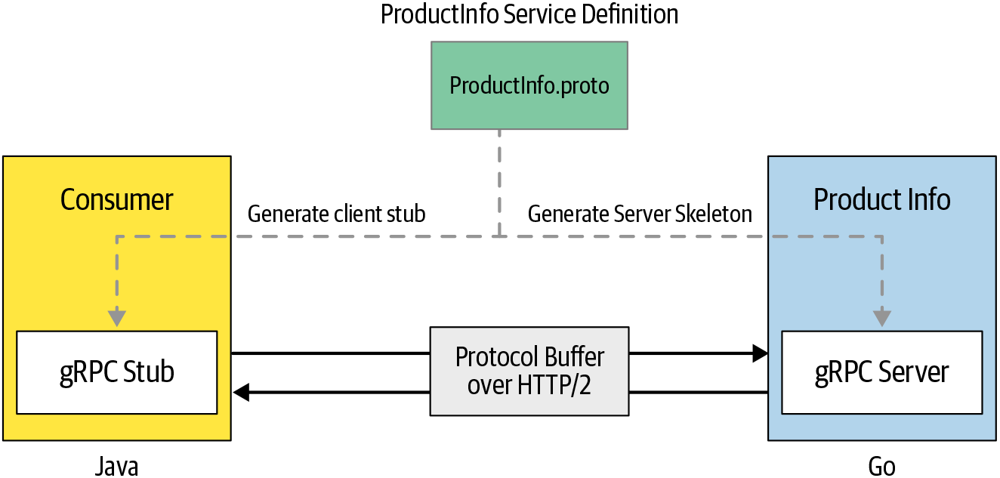

# gRPC codes



- A go grpc server
- A python grpc client

---

## Main components of gRPC

- `proto` files (service definition)
- `stubs` (client side)
- `skeletons` (server side)

---

## gRPC server

```bash
go run server/main.go
```

## gRPC client

```bash
python client/main.py
```

---

## gRPC reflection

- Use `postman` to test the gRPC server (load the service definition via `reflection`)

---

## Reference

- Refer to gRPC documentation [gRPC docs](https://grpc.io/docs/what-is-grpc/introduction/)
- Refer to gRPC go for golang specific server & client codes [gRPC golang basic tutorial](https://grpc.io/docs/languages/go/basics/)
- Refer to gRPC guides [gRPC guides](https://grpc.io/docs/guides/)
- [gRPC go examples](https://github.com/grpc/grpc-go/tree/master/examples)
- [goFiber + gRPC](https://github.com/gofiber/recipes/tree/master/fiber-grpc)
